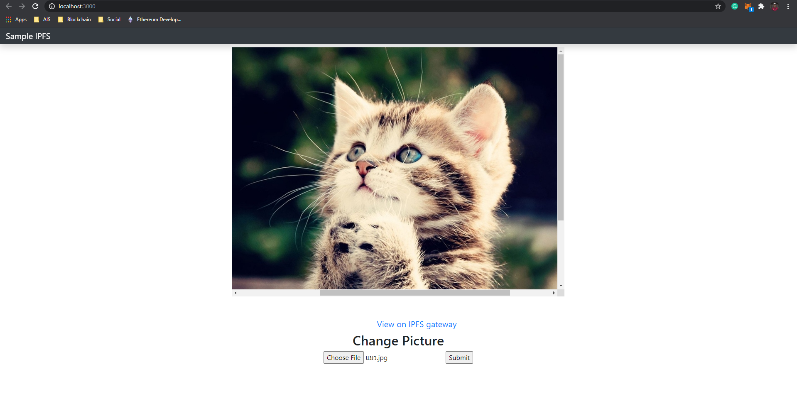

# InterPlanetary File System + ReactJS
<p align="center">
  
</p>

Tutorial using IPFS with nodejs
To run these tutorials, you must have the following installed:
- [nodejs](https://nodejs.org/en/)
- [nvm](https://github.com/nvm-sh/nvm)
- [go-ipfs](https://github.com/ipfs/go-ipfs)
  If you want to call with your local ipfs.

``` bash
# clone repository and install
git clone https://github.com/MASDXI/ipfs-with-react.git
cd ipfs-with-react
npm install
```

``` bash
# Web Application start at http://localhost:3000
npm start
```

``` bash
# expecting output in console.log <CID_HASH>
CID: Qm...

# example result
# CID: QmUCTkyFkg6ScFeHzNwYDSoUnCYtejiJZdZQtXw5RtU5bW
```

Example result [here](https://ipfs.io/ipfs/QmUCTkyFkg6ScFeHzNwYDSoUnCYtejiJZdZQtXw5RtU5bW)
